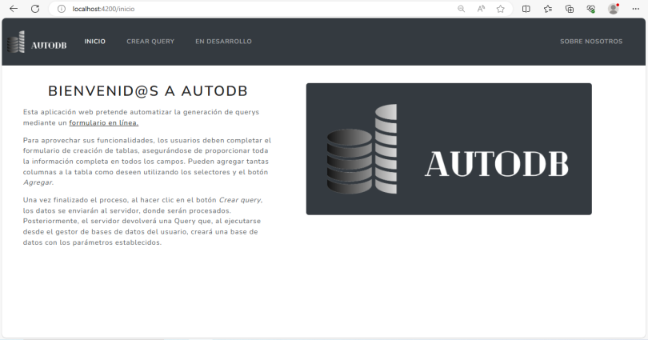
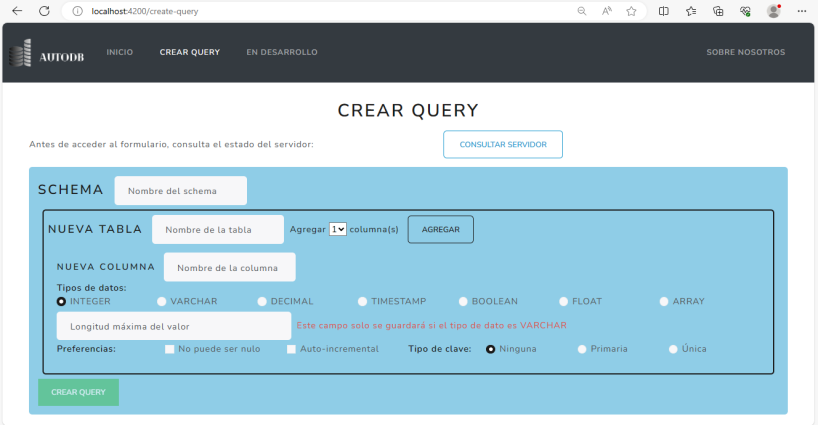
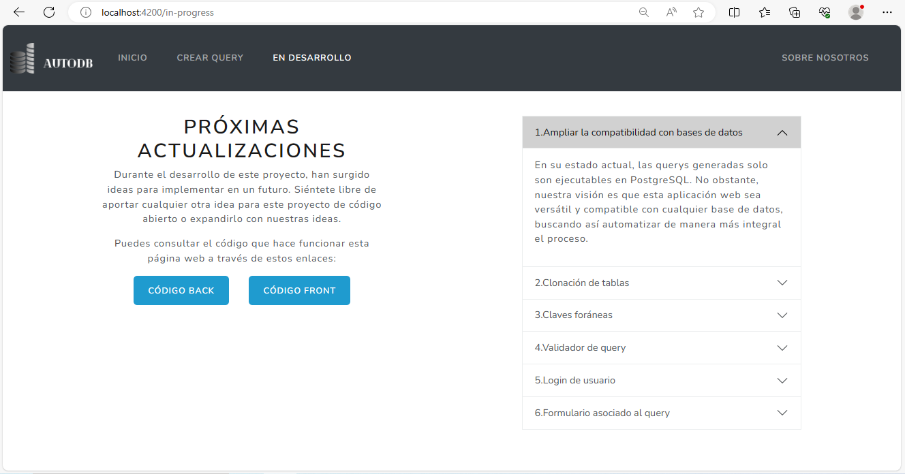
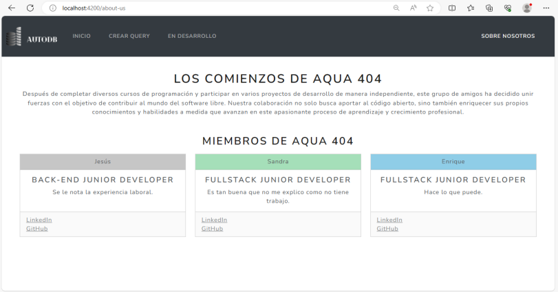

# AutoDB
AutoDB es una aplicación web pretende automatizar la generación de querys mediante un formulario en línea.

Para aprovechar sus funcionalidades, los usuarios deben completar el formulario de creación de tablas, asegurándose de proporcionar toda la información completa en todos los campos. Pueden agregar tantas columnas a la tabla como deseen utilizando los selectores y el botón *Agregar*.

Una vez finalizado el proceso, al hacer clic en el botón _Crear query_, los datos se enviarán al servidor, donde serán procesados. Posteriormente, el servidor devolverá una Query que, al ejecutarse desde el gestor de bases de datos del usuario, creará una base de datos con los parámetros establecidos.

Para desarrollar este proyecto se han utilizado los frameworks **Spring** y __Angular__.

## Build
Para hacer funcionar AutoDB debes instalar los siguientes paquetes:

npm install
npm i bootstrap
npm i bootswatch@5.3.0
npm i @ng-bootstrap/ng-bootstrap

Podrás acceder a AutoDB desde el enlace http://localhost:4200, el cual te redireccionará al menú de inicio. Sabrás que estás en AutoDB ya que la web tiene un icono propio en la pestaña del navegador.

## Inicio
En la pagina de inicio encontramos una descripción de la función principal así como un enlace a esta.

## Crear tabla
Esta es la principal funcionalidad de nuestro proyecto, se trata de un formulario diseñado para la creación de bases de datos, a partir de los parámetros enviados genera una query para automatizar la creación de una base de datos.

## En desarrollo
Esta página tiene el futuro de AutoDB en una lista de acciones a continuar despues de la ***Open Source Jam***. Además, se puede consultar el código de los repositorios de __GitHub__.

## Sobre nosotros
Por último, en este apartado podrás ver quiénes son y seguir a los integrantes del equipo que han desarrollado este proyecto.

